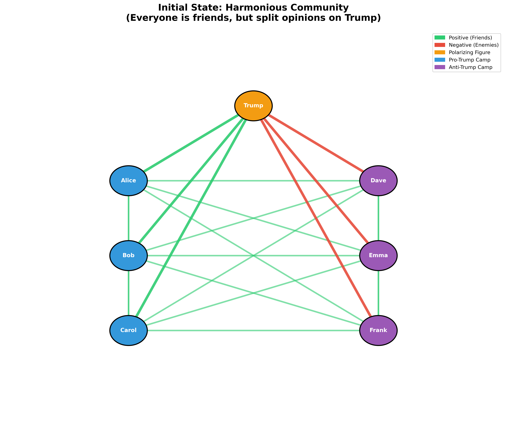
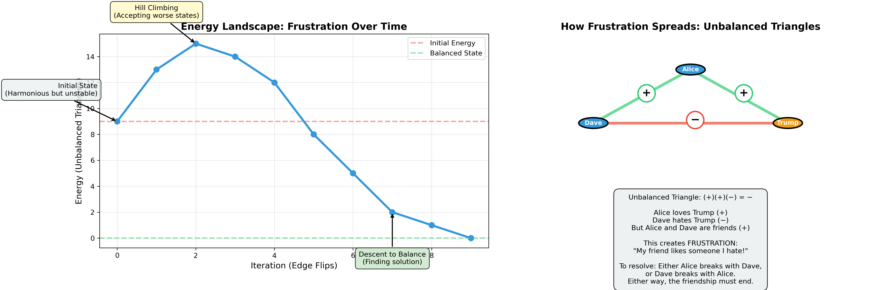
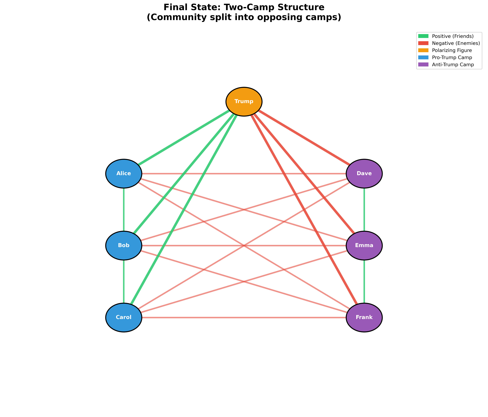

# Coke or Sparkling Water?

## An examination of why we desire what we desire

---

Why do children not like Brussels sprouts? Because they taste bad. And no matter what you do, you can't get the child to eat a Brussels sprout.

René Girard is a philosopher and the thinker behind this Substack that I'm now starting. His most well-known theory is the concept of mimesis, the idea that we get our desires from other people—we model what we want based on what we see other people wanting. So a naive reading of Girard would make one think: how do you get a kid to eat Brussels sprouts? You have the parents sit at the kitchen table and eat Brussels sprouts, saying, "Mm, aren't these Brussels sprouts good?" And then eventually the kid will want them as well, as if this desire is imparted by pure osmosis. And of course, it doesn't.

This is exactly the example that Joshua Landy uses to critique the idea of mimetic desire as something ridiculous and obviously made up—to show that in most cases we know, our desire is intrinsic. It is based on value, taste, pleasure, or utility, and not on what we see other people do. Landy writes:

> "Nothing is more mimetic," declares Girard, "than the desire of a child." One wonders, has he ever met a child? Has he ever tried to feed one a brussels sprout? "Yum yum," we say, absurdly hoping that our desire for healthy food will carry over mimetically. "Blech," says the child, unceremoniously spitting it out. You can't get a child to want to eat brussels sprouts, because this kind of desire depends on liking, and children just don't like brussels sprouts.

But Landy's asking the wrong question. The fact that this child wasn't converted to the cult of Brussels sprout eaters in the moment doesn't matter. The interesting phenomenon to examine is how that child grows up to be the kind of person that wants Brussels sprouts over things that taste much better—to the point where they're ordering Brussels sprouts as an appetizer at a fancy restaurant instead of the mac and cheese. This is the question we now set out to answer (and no, it's not just that their taste buds "change").

---

## The Devil in the Sauna

I was at the gym the other day, and there was a gentleman in the sauna who was quite talkative. He said to the guy next to him, "I just love a Monday workout because on Mondays you don't really have to go to the gym, and the Devil is whispering in your ear, 'just go home.' But then you go anyway, you get the work in, you feel great." This gentleman also happened to have a tattoo of the cross on his left forearm.

Funnily enough, I had just listened to René Girard's essay on anorexia during my workout. And I've now come to understand that perhaps the devil was at work in that very sauna—but not in the way this gentleman thought.

The reason people work out, what's been made out to seem, is that they do it for their health. They eat well, run, hike, bike—all supposedly for their health. Not only are all these phenomena of exercise totally modern in nature, but they're also extraordinarily strenuous, tiring, and in the moment, physically unpleasant. They're miserable. If such activities were a food, they might be a Brussels sprout. Girard links this exercise contagion to what he calls "the thinness imperative."

Girard writes:

> In order to cope with the thinness imperative without getting involved in practices that endanger their health or destroy their self-respect, many people have a secret weapon: they exercise. Much of their time is spent walking, running, jogging, bicycling, swimming, jumping, climbing mountains, and practicing other horribly boring and strenuous activities for the sole purpose of eliminating unwanted calories.

And he continues:

> The irritating aspect of exercise is its politically correct justification in terms of outdoor living, communion with nature, the earth mother, Thoreau, Rousseau, ecology, healthy living... The only real motivation is the desire to lose weight.

But here I think Girard oversimplifies and does himself a disservice. The reason people exercise is not purely this mechanical desire to be skinny, to burn calories. When you see that other person in the gym, when you see the colleague at work who's running the marathon, when you see on social media someone going for a hike over the weekend, when you see the Red Bull skier skiing down K2, you don't just want to do those things because they burn calories. You want to be like the person who does those things—or more precisely, you want to be the sort of person who could do something like that.

Such activities come with an aura of prestige and accomplishment, not just "thinness." The people in our society who do these things are viewed as accomplished. They're the same people who go to the gym and get shredded. They're disciplined, successful, typically wealthy, high-class. And you want to be like them—to be looked at the way you look at them.

Despite this oversimplification, Girard actually points to something that highlights this broader model worship beyond just the body. He traces the origins of the thinness imperative to the aristocracy of 19th century Europe, specifically to Elisabeth of Austria, the wife of Emperor Franz Joseph, better known as Sisi. She was not only physically fit, slim, dedicated to gymnastics and various sports, but she also "presented herself as a 'new woman,'" seeking "an identity of her own... in a special body culture which made her into the prototype of the modern 'advanced' woman."

Sisi triggered "a pattern of mimetic rivalry among the numerous aristocratic ladies who had nothing to do but to look up to Sisi and Eugenie [Empress of France] and copy their behavior down to the last detail." This mimetic rivalry has been "widening and intensifying ever since," writes Girard. "After World War I, the escalation reached the middle class and after World War II, at least in the opulent West, it spread to all social classes." What began with two empresses comparing waistlines in a private room has cascaded down through society until now hundreds of Sisyphean characters run loops in Central Park at all hours of the day.

In all these cases—the Sweetgreen lunch, the Brussels sprout appetizer, the sparkling water instead of Coke—these people are overcoming their natural inclinations and animal appetites. An animal has the instinct to eat things that are caloric, not to exert energy without return, to drink things that are sweet and sugary. But here we see people doing the opposite: choosing things that are objectively harder, less pleasant, more effortful, purely to satisfy their mimetic desires.

## The friend of my enemy is my enemy

And this doesn't happen just in choosing what to have for lunch or whether to go to the gym. This same mechanism has now crept into not just the area of personal health, but of politics. We see it in the phenomenon of boycotting, where members of one political party or another boycott goods that become associated with the opposing party. Why do they do this? Why would someone give up a product they've enjoyed their whole lives because of a single advertisement or political association?

The classic example was the Bud Light boycott. Individuals on the right stopped drinking Bud Light because the company put out an ad with Dylan Mulvaney, a transgender influencer. It became a show of: I don't want to be associated with that. Because Bud Light is gay, and I don't want to be gay. I'm using "gay" here to mean liberal, almost. It really is a term that stands in certain circles for just "the other."

Take another example, another drink-based one. When the CEO of Coca-Cola presented Donald Trump at the White House with an inaugural Diet Coke bottle—because Trump allegedly drinks 12 Diet Cokes a day and has a button where he presses it and gets a Diet Coke—people on the left were obviously not happy about this. There were calls on social media to boycott Coke, people saying, "This is the last Coke I'll drink. Switching to Pepsi."

This is where Landy's critique totally falls apart. Remember, Landy argues that people drink Coke because it tastes good, that people enjoy the product, and that's why they keep coming back for more. He writes: "I can drink Coke, as Penélope Cruz appears to be urging, or Pepsi, following the promptings of Cindy Crawford. (I can even stick to water, following my doctor's more sensible advice.) ... the reason people keep coming back for more is not that they keep seeing commercials; it is that they enjoy the product."

But here we have people who really liked Coke. They thought it tasted good. Or maybe they were neutral on it—they didn't care either way. And the only reason they're giving it up is this political dimension. What's forming their opinion of the product is not the actual sensation, not the chemical experience of tasting it. It's purely this mimetic dimension.

To understand this better, let me introduce an idea that explains what's happening: balance theory. The subject-model-object framework creates a triangle. The subject wants to be like the model. The model desires the object, so then the subject desires the object.

Balance theory says there are four possible combinations of triangles with positive and negative edges: +++ (all positive), ++- (two positive, one negative), +-- (one positive, two negative), or --- (all negative). Only two of those are stable: +++ and +--.

+++ makes sense—I like my friend, my friend likes X, I like X. +-- is when it's us against them. It may not be the best thing in the world, but it is stable. You know who is on your team and you know who you're against. ++- is confusing—that's when you're friends with two people who hate each other, or you like someone who likes something you hate.

In our Trump-Coke example, we have the subject—your average liberal. The model in this case is Trump. Now, Trump might not seem like a model to liberals, but he serves as an anti-model. Whatever Trump does, they do the opposite. They hate Trump, so that has a negative edge. Trump likes Coke—that's a positive edge. The question then becomes: do you like Coke or hate Coke?

Let's say this person liked Coke to begin with. Now we have a triangle with two positive edges and one negative. As a subject, you have trouble liking Coke because Trump likes Coke, and you hate Trump. You don't like anything Trump does. And if that's so important to you, you would stop liking Coke. Then it becomes: you hate both Coke and Trump. Coke and Trump are on a team together, and you hate both of them. Trump and Coke are Republican, you're a Democrat. Maybe Pepsi's on your team, so you start drinking more Pepsi.

The other option is for Coke to stop liking Trump. Coke distances itself from Trump. Maybe it goes neutral. Maybe it explicitly says, "We don't actually like Trump's policies that much," and walks back the whole White House thing. That's what Bud Light did after the Dylan Mulvaney situation—they walked back their rhetoric and did an advertisement with Shane Gillis and Post Malone, aiming for the opposite demographic, or maybe neutral ground.

So people stop drinking Coke or Bud Light—who cares? It's probably better for them anyway, right? The thing about this balance theory is that it scales. And when you apply it to broader communities of people (modeled as a social graph) the results can be quite dramatic.

## How Polarization Tears Communities Apart

Think about a friend group. Six people who've known each other for years. They have dinners together, go on trips, celebrate birthdays.

But then (and this may sound familiar) Trump comes into the picture: three of them love Trump, and three of them hate him. However, they formed this position (whether it be the through the media, the newspaper, or facebook), it's non-negotiable. 

Alice and Dave have been friends since college. They're in group chats together, they went to each other's weddings. But now, Alice loves Trump and Dave can't stand him.

This is another unbalanced triangle: ++-. And forget the math, as we know in our politically polarized world, it's hard to be friends with someone who loves a politician you despise. (It should be noted also that the fact that Trump is the polarizing figure is irrelevant; the mechanism is the same whether it's Trump or Pelosi or whoever else.) 

So, since this negative edge is so strong, the friendship is unsustainable. Not because Alice and Dave don't care about each other. But because this fundamental disagreement about a polarizing figure creates a tension that pervades everything. They can't talk about politics. One of them is always biting their tongue. Every news cycle is a minefield. The friendship that once felt easy now requires constant emotional labor.

If you've lived through the Trump era, you know this feeling. You've either been Alice or Dave. Maybe you've lost friends over it. Maybe you're the one who pulled away. Maybe you just stopped returning calls, stopped showing up, let the relationship quietly dissolve because it became too hard to maintain. 

And it's not just one friendship. In this friend group of six, every person who loves Trump has this tension with every person who hates Trump. That's nine unbalanced triangles spread across the network. The entire community is a web of unsustainable relationships.

So what happens? The only way to resolve these unbalanced triangles is for friendships to break. But this isn't a clean process towards stability. It doesn't happen all at once. It gets worse first.

When we measure the "energy" of this network—counting how many unbalanced triangles exist—the initial state starts at 9. That's nine points of tension, nine unsustainable relationships. You might think: okay, if Alice breaks with Dave, that should reduce the tension, right?

Wrong. It gets worse first.

The normal way you'd solve a problem like this—finding a balanced state in a network—is through something called gradient descent. It's the same technique used in machine learning algorithms. The idea is simple: you look for a move that takes the energy of the whole network down. In this case, a "move" means flipping an edge—breaking a friendship or improving one. You scan through all possible moves, find the one that reduces the most unbalanced triangles, make that move, and repeat. It's a rational, systematic way to reach stability.

The problem is this method completely breaks down when there are no moves that lower the energy. And in our Trump friend group scenario, that's exactly what happens. Not only is there no move that lowers the energy—every single possible move makes things worse initially.

When the first friendship breaks, the energy actually goes up—from 9 to 13. More people get upset. More relationships become strained. It feels like the community is falling apart, and in a sense, it is. The second break makes it worse still: energy climbs to 15.

The only way to escape this trap is through something called hill climbing. You have to accept moves that make things worse, hoping that if you climb high enough, you'll find a path down the other side to a better state. In practice, this means introducing some random probability that you'll make an irrational move—breaking a friendship even though it increases tension—just to escape being stuck.

But here's the thing: the hill you have to climb in this scenario is dramatic. It requires multiple seemingly irrational moves in sequence, each one making things worse, before you can start reorganizing the network toward balance. The probability of this happening naturally—of people making just the right sequence of friendship-breaking decisions to eventually reach stability—is vanishingly small.

This tells me something important: the way we're solving this problem mathematically probably isn't a good model for how these dynamics actually work in society. People aren't doing rational calculations in their heads about network energy. We're not "Homo Networkbalancicus," any more than we're Homo Economicus. That's something I'll explore in a future post—a better way to model this.

But for now, if we stick with the graph theory, the concept remains the same: to reach a stable state, the community must first pass through a period of increased chaos. Things must get worse before they can get better. Friendships that could have survived must break to resolve the broader pattern. It's not enough for Alice and Dave to drift apart—the entire structure of the social network has to reorganize.

And of course, the ideal solution would be for everyone to agree about Trump—either everyone loves him or everyone hates him. Then the network would naturally balance. But that's not how our world works. The polarization is fixed. People are stuck in their echo chambers, their opinions shaped by media consumption and tribal identity. So given that our model has these fixed edges, the only possible resolution is for the energy and frustration of the entire network to spike upward, and for the community to tear itself apart.

And eventually, it does. Friendships continue to break—Alice with Dave, Bob with Emma, Carol with Frank. The group chat goes quiet. People stop getting invited to things. The community splits.

In the end, you have two camps. Camp One: Alice, Bob, and Carol—the Trump supporters. They're still friends with each other. Camp Two: Dave, Emma, and Frank—the Trump opponents. They're still friends with each other. But between the camps? Nothing but negative edges. Not just absence of friendship—active hostility. People who used to care about each other now can't stand each other.

And the energy? Zero. Fully balanced. Every triangle resolves: within each camp, everyone agrees (+)(+)(+) = +1. Across camps, it's us against them (+)(−)(−) = +1. Alice loves Trump, hates Dave, Dave hates Trump. Balanced.

The community is "stable" now. The temperature drops. Everyone is comfortable again—as long as they stay within their camp. But this isn't the harmony they started with. This is a cold war. Two mutually exclusive groups, totally antagonistic to each other. And that can be just as dangerous.

---

## The Conquest of Self and Other

But Girard points out that this seemingly innocent phenomenon sits on a continuum. And on the more extreme ends of that same bell curve, we find the exact same mechanism leading to disastrous consequences. Most notably: anorexia. The desire to be thin, fit, attractive, high-class—the very same desire that makes someone order the Brussels sprouts—can escalate to the point where you overcome not just your appetite for sweets, but all appetite. All your animal needs are sacrificed purely in pursuit of the holy grail of thinness, even to the point of extreme ill health and, in some cases, death.

This is where Girard's analysis becomes chilling. The anorexic has overcome the most basic human need of all—the need to survive—out of mimetic desire. Girard compares the anorexic to Napoleon, to Alexander the Great: "In the competition for absolute thinness, the true anorexic is Julius Caesar, Alexander the Great, and Napoleon all rolled into one." This person has maniacally conquered their own being. Every obstacle of appetite, every instinct for survival, left in the dust. They have sacrificed themselves to the conquering of their own body, their own flesh.

The anorexic declares war on herself. The model becomes the god of thinness—the unattainable ideal. And the enemy? Food. Fat. Sustenance. The very things the body needs to survive. She will deprive herself of what she needs, override every biological signal screaming for nourishment, all in service of this mimetic pursuit.

Now here's the parallel: Once these political relationships become established—once Trump becomes your model or your anti-model, once the other camp becomes the enemy—the same mechanism takes hold. You will deprive yourself of things you need. That Coke you actually enjoyed. Those friendships that mattered to you. The sense of community you once had. You'll give it all up to maintain tribal purity, to stay aligned with your camp, to not betray the cause.

And just as the anorexic conquers her body through extreme deprivation, the political zealot conquers the enemy tribe. The Republican conquers the Democrat. The Democrat conquers the Republican. It's the same mimetic mechanism—the same capacity to override self-preservation, to sacrifice what you need, to declare total war in pursuit of a model and against an enemy.

This is why it matters. This is why we should pay attention to these seemingly silly cultural phenomena—the Coke boycotts, the Bud Light controversies, the sparkling water instead of soda. Because it's the same mechanism. It's a difference of degree, not of kind.

The same dynamic that makes you choose Brussels sprouts over mac and cheese can make you choose your political tribe over your friendships. And if it escalates far enough, it's that same mechanism which will make you overcome your animal need to survive, your instinct for self-preservation, in order to be a good member of your tribe—whether that's left or right.

That's the danger. How exactly this mechanism escalates to violence, how it has worked in past societies, and how it will work in ours—that's a story for another day. We have more theory to work through, and we have more dynamics to understand.

---

But friends, newcomers, if you've made it this far, thank you for reading my first post of a publication I'm calling **Political Atheism**, a title which, to those who know Girard's theory, is hopefully clear. To those who do not, I will explain at some point. I hope you found this useful. I thank you for taking the time to read. I'm hoping to find the time to do posts like these frequently enough, so if you aren't already, throw your email in. I think that given this crazy state of the world, these are important ideas to be exploring. And I welcome any feedback, any thoughts, any comments. If you know me, feel free to reach out personally. I'd love to pick up the phone and talk through this stuff if you find this of interest.

-Best, Ajax's Sheep.
