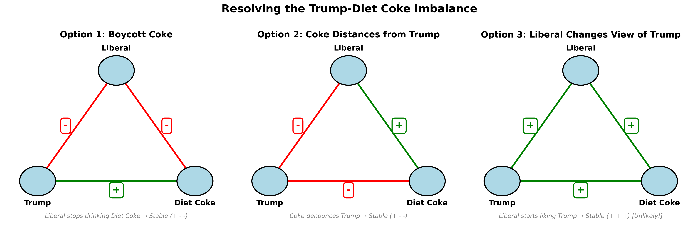

# Coke or Sparkling Water?

## An examination of why we desire what we desire

---

Why do children not like Brussels sprouts? Because they taste bad. And no matter what you do, you can't get the child to eat a Brussels sprout.

René Girard is a philosopher and the thinker behind this Substack that I'm now starting. His most well-known theory is the concept of mimesis, the idea that we get our desires from other people—we model what we want based on what we see other people wanting. So a naive reading of Girard would make one think: how do you get a kid to eat Brussels sprouts? You have the parents sit at the kitchen table and eat Brussels sprouts, saying, "Mm, aren't these Brussels sprouts good?" And then eventually the kid will want them as well, as if this desire is imparted by pure osmosis. And of course, it doesn't.

This is exactly the example that Joshua Landy uses to critique the idea of mimetic desire as something ridiculous and obviously made up—to show that in most cases we know, our desire is intrinsic. It is based on value, taste, pleasure, or utility, and not on what we see other people do. Landy writes:

> "Nothing is more mimetic," declares Girard, "than the desire of a child." One wonders, has he ever met a child? Has he ever tried to feed one a brussels sprout? "Yum yum," we say, absurdly hoping that our desire for healthy food will carry over mimetically. "Blech," says the child, unceremoniously spitting it out. You can't get a child to want to eat brussels sprouts, because this kind of desire depends on liking, and children just don't like brussels sprouts.

But Landy's asking the wrong question. The fact that this child wasn't converted to the cult of Brussels sprout eaters in the moment doesn't matter. The interesting phenomenon to examine is how that child grows up to be the kind of person that wants Brussels sprouts over things that taste much better—to the point where they're ordering Brussels sprouts as an appetizer at a fancy restaurant instead of the mac and cheese. This is the question we now set out to answer (and no, it's not just that their taste buds "change").

---

## The Devil in the Sauna

I was at the gym the other day, and there was a gentleman in the sauna who was quite talkative. He said to the guy next to him, "I just love a Monday workout because on Mondays you don't really have to go to the gym, and the Devil is whispering in your ear, 'just go home.' But then you go anyway, you get the work in, you feel great." This gentleman also happened to have a tattoo of the cross on his left forearm.

Funnily enough, I had just listened to René Girard's essay on anorexia during my workout. And I've now come to understand that perhaps the devil was at work in that very sauna—but not in the way this gentleman thought.

The reason people work out, what's been made out to seem, is that they do it for their health. They eat well, run, hike, bike—all supposedly for their health. Not only are all these phenomena of exercise totally modern in nature, but they're also extraordinarily strenuous, tiring, and in the moment, physically unpleasant. They're miserable. If such activities were a food, they might be a Brussels sprout. Girard links this exercise contagion to what he calls "the thinness imperative."

Girard writes:

> In order to cope with the thinness imperative without getting involved in practices that endanger their health or destroy their self-respect, many people have a secret weapon: they exercise. Much of their time is spent walking, running, jogging, bicycling, swimming, jumping, climbing mountains, and practicing other horribly boring and strenuous activities for the sole purpose of eliminating unwanted calories.

And he continues:

> The irritating aspect of exercise is its politically correct justification in terms of outdoor living, communion with nature, the earth mother, Thoreau, Rousseau, ecology, healthy living... The only real motivation is the desire to lose weight.

But here I think Girard oversimplifies and does himself a disservice. The reason people exercise is not purely this mechanical desire to be skinny, to burn calories. When you see that other person in the gym, when you see the colleague at work who's running the marathon, when you see on social media someone going for a hike over the weekend, when you see the Red Bull skier skiing down K2, you don't just want to do those things because they burn calories. You want to be like the person who does those things—or more precisely, you want to be the sort of person who could do something like that.

Such activities come with an aura of prestige and accomplishment, not just "thinness." The people in our society who do these things are viewed as accomplished. They're the same people who go to the gym and get shredded. They're disciplined, successful, typically wealthy, high-class. And you want to be like them—to be looked at the way you look at them.

Despite this oversimplification, Girard actually points to something that highlights this broader model worship beyond just the body. He traces the origins of the thinness imperative to the aristocracy of 19th century Europe, specifically to Elisabeth of Austria, the wife of Emperor Franz Joseph, better known as Sisi. She was not only physically fit, slim, dedicated to gymnastics and various sports, but she also "presented herself as a 'new woman,'" seeking "an identity of her own... in a special body culture which made her into the prototype of the modern 'advanced' woman."

Sisi triggered "a pattern of mimetic rivalry among the numerous aristocratic ladies who had nothing to do but to look up to Sisi and Eugenie [Empress of France] and copy their behavior down to the last detail." This mimetic rivalry has been "widening and intensifying ever since," writes Girard. "After World War I, the escalation reached the middle class and after World War II, at least in the opulent West, it spread to all social classes." What began with two empresses comparing waistlines in a private room has cascaded down through society until now hundreds of Sisyphean characters run loops in Central Park at all hours of the day.

In all these cases—the Sweetgreen lunch, the Brussels sprout appetizer, the sparkling water instead of Coke—these people are overcoming their natural inclinations and animal appetites. An animal has the instinct to eat things that are caloric, not to exert energy without return, to drink things that are sweet and sugary. But here we see people doing the opposite: choosing things that are objectively harder, less pleasant, more effortful, purely to satisfy their mimetic desires.

## The friend of my enemy is my enemy

And this doesn't happen just in choosing what to have for lunch or whether to go to the gym. This same mechanism has now crept into not just the area of personal health, but of politics. We see it in the phenomenon of boycotting, where members of one political party or another boycott goods that become associated with the opposing party. Why do they do this? Why would someone give up a product they've enjoyed their whole lives because of a single advertisement or political association?

The classic example was the Bud Light boycott. Individuals on the right stopped drinking Bud Light because the company put out an ad with Dylan Mulvaney, a transgender influencer. It became a show of: I don't want to be associated with that. Because Bud Light is gay, and I don't want to be gay. I'm using "gay" here to mean liberal, almost. It really is a term that stands in certain circles for just "the other."

Take another example, another drink-based one. When the CEO of Coca-Cola presented Donald Trump at the White House with an inaugural Diet Coke bottle—because Trump allegedly drinks 12 Diet Cokes a day and has a button where he presses it and gets a Diet Coke—people on the left were obviously not happy about this. There were calls on social media to boycott Coke, people saying, "This is the last Coke I'll drink. Switching to Pepsi."

This is where Landy's critique totally falls apart. Remember, Landy argues that people drink Coke because it tastes good, that people enjoy the product, and that's why they keep coming back for more. He writes: "I can drink Coke, as Penélope Cruz appears to be urging, or Pepsi, following the promptings of Cindy Crawford. (I can even stick to water, following my doctor's more sensible advice.) ... the reason people keep coming back for more is not that they keep seeing commercials; it is that they enjoy the product."

But here we have people who really liked Coke. They thought it tasted good. Or maybe they were neutral on it—they didn't care either way. And the only reason they're giving it up is this political dimension. What's forming their opinion of the product is not the actual sensation, not the chemical experience of tasting it. It's purely this mimetic dimension.

To understand this better, let me introduce an idea that explains what's happening: balance theory. The subject-model-object framework creates a triangle. The subject wants to be like the model. The model desires the object, so then the subject desires the object.

Balance theory says there are four possible combinations of triangles with positive and negative edges: +++ (all positive), ++- (two positive, one negative), +-- (one positive, two negative), or --- (all negative). Only two of those are stable: +++ and +--.

+++ makes sense—I like my friend, my friend likes X, I like X. +-- is when it's us against them. It may not be the best thing in the world, but it is stable. You know who is on your team and you know who you're against. ++- is confusing—that's when you're friends with two people who hate each other, or you like someone who likes something you hate.

In our Trump-Coke example, we have the subject—your average liberal. The model in this case is Trump. Now, Trump might not seem like a model to liberals, but he serves as an anti-model. Whatever Trump does, they do the opposite. They hate Trump, so that has a negative edge. Trump likes Coke—that's a positive edge. The question then becomes: do you like Coke or hate Coke?

Let's say this person liked Coke to begin with. Now we have a triangle with two positive edges and one negative. As a subject, you have trouble liking Coke because Trump likes Coke, and you hate Trump. You don't like anything Trump does. And if that's so important to you, you would stop liking Coke. Then it becomes: you hate both Coke and Trump. Coke and Trump are on a team together, and you hate both of them. Trump and Coke are Republican, you're a Democrat. Maybe Pepsi's on your team, so you start drinking more Pepsi.

The other option is for Coke to stop liking Trump. Coke distances itself from Trump. Maybe it goes neutral. Maybe it explicitly says, "We don't actually like Trump's policies that much," and walks back the whole White House thing. That's what Bud Light did after the Dylan Mulvaney situation—they walked back their rhetoric and did an advertisement with Shane Gillis and Post Malone, aiming for the opposite demographic, or maybe neutral ground.

So people boycott Coke, boycott Bud Light—who cares? It's just consumer choices, right? The thing about this balance theory is that it scales. And when you apply it to social graphs, it can lead to quite dramatic outcomes.

--------------------------------

But Girard points out that this seemingly innocent phenomenon sits on a continuum. And on the more extreme ends of that same bell curve, we find the exact same mechanism leading to disastrous consequences. Most notably: anorexia. The desire to be thin, fit, attractive, high-class—the very same desire that makes someone order the Brussels sprouts—can escalate to the point where you overcome not just your appetite for sweets, but all appetite. All your animal needs are sacrificed purely in pursuit of the holy grail of thinness, even to the point of extreme ill health and, in some cases, death.

This is where Girard's analysis becomes chilling. The anorexic has overcome the most basic human need of all—the need to survive—out of mimetic desire. Girard compares the anorexic to Napoleon, to Alexander the Great: "In the competition for absolute thinness, the true anorexic is Julius Caesar, Alexander the Great, and Napoleon all rolled into one." This person has maniacally conquered their own being. Every obstacle of appetite, every instinct for survival, left in the dust. They have sacrificed themselves to the conquering of their own body, their own flesh.

  
<!-- Now take it a step further  into the political realm. .. these previous examples overcame your own body, vain desire and pursuit of prestige ... now we see a new phenomenon emerging where people are willing to sacrifice their needs but for political deities ... the innocuous example of coke ... And maybe we make a political comparison like, and the military comparison, I think, is actually quite apt. Think of what the Great Conquerors had to do. They had to convince not only themselves but others that their pursuits were worth doing. It was worth sacrificing energy, physical suffering, hunger, perhaps even your life itself for a greater cause, for the nation, for country, for glory, for honor. In some cases, that uses the desire for individual prestige to their advantage. In other cases, it's more of a collective pursuit, but there's always a model, and an ideal to pursue, right? The unknown soldier, et cetera. And it's the same mechanism that is used in a simple decision to decide what to eat or what not to eat, which also makes us decide: do we go over into this cause to pursue eternal glory on the battlefield? So to say that the phenomenon described is innocuous would be a great misstep and miss the potential for this dynamic to expand much grander frontiers. -->

---

Similarly, Landy discusses the example of Coca-Cola. People point to advertisements—Coke advertisements—as examples of how mimesis occurs in society, how if you put someone attractive, a celebrity, drinking a Coke on TV, it will make people want to drink Coke more. Landy's critique is that people just want to drink Coke, that Coke tastes good, and that is why people drink it.

He argues: "I can drink Coke, as Penélope Cruz appears to be urging, or Pepsi, following the promptings of Cindy Crawford. (I can even stick to water, following my doctor's more sensible advice.) ... the reason people keep coming back for more is not that they keep seeing commercials; it is that they enjoy the product."

---

## Girard's Actual Position

Now the thing is, René Girard discussed this point exactly on multiple occasions. In a 2005 interview, when pushed on how far he takes the idea that desire is fundamentally mimetic, Girard draws a crucial distinction:

> Maybe one can start from this question: what is the difference between need, appetite, and desire? Need is an appetite all animals have. We know very well that if we are alone in the Sahara Desert and we are thirsty, we don't need a model to want to drink. It's a need that we have to satisfy. But most of our desires in a civilised society are not like that.
>
> Think of vanity, or snobbery. What is snobbery? In snobbery, you desire something not because you really had an appetite for it, but because you think you look smarter, you look more fashionable, if you imitate the man who desires that object, or who also pretends to desire it.

So Girard absolutely acknowledges that we have intrinsic needs and appetites. Children are especially averse to bitter foods, which [may have been an adaptation to avoid poisonous berries](https://pmc.ncbi.nlm.nih.gov/articles/PMC4654709/). Opposingly, you have Coke where sweet sugar corresponds with calories, and calories with survival. In both cases, we have certain chemical and biological developments that make it so. We have certain intrinsic needs and appetites that are well-documented and undeniable, and Girard doesn't deny them—the most fundamental is the appetite for self-preservation.

Where Girard's theory intervenes is that these appetites and needs, while real, are oftentimes secondary to our desire for things that aren't needs but are wants, dictated more by what others think of us, or what we see others do, what we think others might think of us, and sometimes most importantly, what we will think of ourselves. These things drive more of our desires than we care to admit.

---

## The Sparkling Water Problem

Let's return to the Coke example. I personally don't drink Coke. Most people I know don't drink Coke. They don't drink soda. Why? Soda tastes good, so shouldn't they drink it? You might say, oh, well, it's obvious—they don't because soda is unhealthy. And there may be empirical truths that show that. But we don't know for a fact if it's healthy or unhealthy. It's only our best guess. And certainly, most of the decisions people make aren't a rational approximation of "this is good" and "this is bad." They may convince themselves that that's how they view the world, but oftentimes it's not. And even so, why does someone want to be healthy? Is it out of, again, that instinct of self-preservation, of wanting to maximize their longevity? Is this the lens through which people view their every move? Maybe for some of these longevity people, that's true, but even then that can't be the root cause of all action.

Now, in the case of Coke, the reason why people don't drink it, or the people of a certain status and class don't drink it, is that they view it as unhealthy, as low class, as bad for you, indulgent. And they view themselves, or they want to be the version of themselves that is high class, disciplined, healthy, fit, hot, desired, etc. So their model is not really the celebrity in the advertisement. Perhaps that reinforces the notion if the person in the advertisement is that sort of person. But there's no anti-Coke advertisement.

Now, this might be a reason why the same sort of person doesn't drink Coke but does drink sparkling water. Sparkling water is zero calorie. It's fizzy. It's overpriced. It signals that you have disposable income enough to be drinking something more than water, but with the same calories and health benefits as water—even if the sparkling water might have artificial flavors, microplastics, or other things that could also be bad for you that we might find out in a decade are bad for us. Now it seems "healthy."

Another classic example is the Brussels sprout appetizer at nice restaurants. You see Brussels sprouts and you think, oh, that must be healthy. I'm going to be good and order the Brussels sprouts. And then they're served to you with bacon bits and oil, and there's no green left, only char. And what you've actually ordered is something that is not any more healthy than a side of fries. And the beautiful thing about this dish is it satisfies two desires: it both tastes good, which satisfies your childish appetite for something tasty, but also it makes you think—it satisfies your mimetic desire to be a healthy person.

And this is the same sort of person who has a salad for lunch or a bowl from Chipotle to cut the carbs of the burrito with basically all the same stuff in it, who walks into the office with a bag with a nice label on it. Again, you cannot chalk that up to, well, they need to eat something for lunch. Why don't they pack a sandwich? Why don't they make a salad at home?

It's because that product says something about them. But more importantly, they are basing their decisions on the imagined person they want to be, who eats this way, who goes to the gym this way, who looks a certain way, talks a certain way, eats a certain way. How did they form this conception of this imagined person? Did they have one singular model? Was there one ad, one relation? No. It's an amalgamation of things. It's what they read, what they watch, who they interact with, who they went to school with, who they grew up with, who their parents are. There's a complex web of interaction that results in something like this, and it's so complex it includes also what they are not, who they view themselves as against or different from: the classes of people, the sorts of people who would drink a Coke or go to Burger King or have a beer, shoot guns, smoke a cigar, smoke a cigarette, drive a truck.

Now I'm making this out to be black and white, red and blue. It's not. There are layers to it. There are different factions within it. There are finance bros who, despite their upbringing in the more Sweetgreen, sparkling water-drinking crowd, have a longing for shotguns, cigars, hunting dogs, and traditional values, and view those groups as models, and have a sort of fantasy of themselves being that sort of person despite being locked in a suffocating urban environment.

---

## When Desire Overrides Taste

Now this becomes most extreme when people forget whatever natural appetites they had for this product or that—this tastes good, this tastes bad—when they neglect that entirely for the mimetic element, for what those products say about you. The classic example of this is the boycotts that have become more popular recently. The classic example was the Bud Light boycott when individuals on the right stopped drinking Bud Light because Bud Light put out an ad with Dylan Mulvaney, who is a transgender person. And it became a show of, well, I don't want to be associated with that. Because Bud Light is gay, and I don't want to be gay. I'm using gay here to mean like liberal, almost. It really is a term that stands in certain circles for just "the other."

Now I'm sure that there are people on the right who really like Bud Light, who like the taste of it, who have drunk it their whole lives. But this one incident said, you know what, I'm going to drink something else now. And maybe they just switched to Budweiser.

Take another example, another drink-based example. When the CEO of Coca-Cola presented Donald Trump at the White House with an inaugural Diet Coke bottle—because Trump allegedly drinks 12 Diet Cokes a day and has a button where he presses it and he gets a Diet Coke—people on the left were obviously not happy about this, and there were calls on social media to boycott Coke, people saying, "This is the last Coke I'll drink. Switching to Pepsi. Whatever."

Now again here, I'm sure some of those people really liked Coke. They really thought it tasted good. So why would they do this? So again, this is why I find Landy's critique lacking. It's because in both these instances, as in many other instances that happen in society, the need, the appetite for Coke, the appetite for Bud Light is there. People like it. The product is good. It tastes good. But it's just totally dwarfed in importance compared to whatever else is going on, and that whatever else is Girard's theory.

---

## Balance Theory and the Trump Triangle

Now I'm going to introduce an idea that's a little different here, which explains both, but we'll focus on the Trump example just because I think it's interesting: balance theory. So you can imagine that this subject-model-object framework creates a triangle. The subject wants to be like the model. The model desires the object, so then the subject desires the object.

Now there's this thing called balance theory that says there are four possible combinations of triangles with positive and negative edges. And this is my own addition—this isn't something Girard really looked into. This is something we'll cover more in a future post, but you can have +++ (all positive), ++- (two positive, one negative), +-- (one positive, two negative), or --- (all negative). Those are your four options. Balance theory says that only two of those are stable: +++ and +--.

+++ makes sense—I like my friend, my friend likes X, I like X. +-- is when it's us against them, so it may not be the best thing in the world, but it is stable. You know who is on your team and you know who you're against. ++- is confusing—that's when you're friends with two people who hate each other, or you like someone who likes something you hate. And then --- is when everybody hates everybody, and it's just confusing. And if you really hated somebody else, you would just team up against them. This is super brief, but I'm just putting it in here just for context.

Now, in our Trump example, we have the subject, which is, you know, your average Joe. Let's say it's one of these liberals in this case. And then the model in this case is Trump. Now, you may say, oh, Trump's not a model to liberals. Well, he serves as an anti-model. Whatever Trump does, they do the opposite. They hate Trump, so that has a negative edge. Then Trump likes Coke—that's a positive edge. And then the question is, what do you do? Do you like Coke or do you hate Coke?

Let's say this person liked Coke to begin with. Now we have a triangle with two positive edges and one negative. So you as a subject have trouble liking Coke because Trump likes Coke, and you hate Trump, right? You don't like anything Trump does. And if that's so important to you, you would therefore stop liking Coke. That's it. Then it becomes you both hate Coke and Trump. Coke and Trump are on a team together, and then you hate both of them. Trump and Coke are Republican, you're a Democrat. Maybe Pepsi's on your team, so you become better friends with Pepsi. Maybe you start drinking more Pepsi, right? That's it.

The other option is for Coke to stop liking Trump. So that's where Coke, which even though that's the object in this framework, can still act. So Coke distances itself from Trump. Maybe it just goes neutral. Maybe it explicitly says, "We don't actually like Trump's policies that much," and then it walks back on the whole White House thing that it did. That's what Bud Light did after this whole shenanigans with the Dylan Mulvaney scandal. They walked back their rhetoric and then did an advertisement with Shane Gillis and Post Malone—the opposite, or maybe sort of neutral. You might call it right-center. So those are the options.

---

## Why This Matters

So why is this important? What is this emblematic of? Why should we pay attention to these sort of silly cultural phenomena? Well, it's because the same mechanism that we describe—where you can overcome your sort of animal taste of liking Coke or hating a Brussels sprout based on your mimetic desire to be healthy or MAGA or anti-Trump—also means that if it escalates, it's that same mechanism which will make it so you can overcome your animal need to survive, of self-preservation, in order for you to be a good member of your political tribe, whether that's right or left.

That's the danger. It's the same mechanism. It's a difference of degree. Now that might sound like a bit of a leap to you, and how exactly we get there and how that works, how this sort of mechanism escalates to violence, is a story for another day. We have more theory to work through, and we have more dynamics to understand before we can get to the point where we genuinely understand how simply boycotting Bud Light or Pepsi or Coke can lead to genuine political violence—how that works, how it has worked in past societies, and how it will work in ours.

---

But friends, newcomers, if you've made it this far, thank you for reading my first post of a publication I'm calling **Political Atheism**, a title which, to those who know Girard's theory, is hopefully clear. To those who do not, I will explain at some point. I hope you found this useful. I thank you for taking the time to read. I'm hoping to find the time to do posts like these frequently enough, so if you aren't already, throw your email in. I think that given this crazy state of the world, these are important ideas to be exploring. And I welcome any feedback, any thoughts, any comments. If you know me, feel free to reach out personally. I'd love to pick up the phone and talk through this stuff if you find this of interest.

-Best, Ajax's Sheep.
