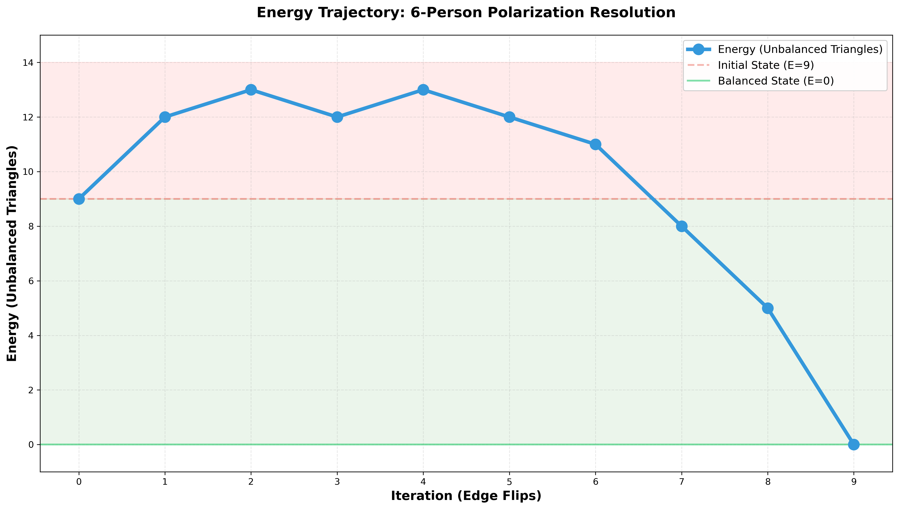

# Why Coke Tastes Like Trump and Bud Light like Dylan Mulvaney

## How Mimetic Desire tears Communities apart

---

Why do children not like Brussels sprouts? Because they taste bad. And no matter what you do, you can't get the child to eat a Brussels sprout.

René Girard is a philosopher and the thinker behind this Substack that I'm now starting. His most well-known theory is the concept of mimesis, the idea that we get our desires from other people—we model what we want based on what we see other people wanting. So a naive reading of Girard would make one think: how do you get a kid to eat Brussels sprouts? You have the parents sit at the kitchen table and eat Brussels sprouts, saying, "Mm, aren't these Brussels sprouts good?" And then eventually the kid will want them as well, as if this desire is imparted by pure osmosis. And of course, it doesn't.

This is exactly the example that Joshua Landy uses to critique the idea of mimetic desire as something ridiculous and obviously made up—to show that in most cases we know, our desire is intrinsic. It is based on value, taste, pleasure, or utility, and not on what we see other people do. Landy writes:

> "Nothing is more mimetic," declares Girard, "than the desire of a child." One wonders, has he ever met a child? Has he ever tried to feed one a brussels sprout? "Yum yum," we say, absurdly hoping that our desire for healthy food will carry over mimetically. "Blech," says the child, unceremoniously spitting it out. You can't get a child to want to eat brussels sprouts, because this kind of desire depends on liking, and children just don't like brussels sprouts.

But Landy's asking the wrong question. The fact that this child wasn't converted to the cult of Brussels sprout eaters in the moment doesn't matter. The interesting phenomenon to examine is how that child grows up to be the kind of person that wants Brussels sprouts over things that taste much better—to the point where they're ordering Brussels sprouts as an appetizer at a fancy restaurant instead of the mac and cheese. This is the question we now set out to answer (and no, it's not just that their taste buds "change").

---

## The Thinness Imperative

I was at the gym the other day, and there was a gentleman in the sauna who was quite talkative. He said to the guy next to him, "I just love a Monday workout because on Mondays you don't really have to go to the gym, and the Devil is whispering in your ear, 'just go home.' But then you go anyway, you get the work in, you feel great." This gentleman also happened to have a tattoo of the cross on his left forearm.

The reason people work out, what's been made out to seem, is that they do it for their health. They eat well, run, hike, bike—all supposedly for their health. Not only are all these phenomena of exercise totally modern in nature, but they're also extraordinarily strenuous, tiring, and in the moment, physically unpleasant. They're miserable. If such activities were a food, they might be a Brussels sprout. Girard links this exercise contagion to what he calls "the thinness imperative."

Girard writes:

> The irritating aspect of exercise is its politically correct justification in terms of outdoor living, communion with nature, the earth mother, Thoreau, Rousseau, ecology, healthy living...The only real motivation is the desire to lose weight.

But here I think Girard oversimplifies and does himself a disservice. The reason people exercise is not purely this mechanical desire to be skinny, to burn calories. When you see that other person in the gym, when you see the colleague at work who's running the marathon, when you see on social media someone going for a hike over the weekend, when you see the Red Bull skier skiing down K2, you don't just want to do those things because they burn calories. You want to be like the person who does those things—or more precisely, you want to be the sort of person who could do something like that.

Such activities come with an aura of prestige and accomplishment, not just "thinness." The people in our society who do these things are viewed as accomplished. They're the same people who go to the gym and get shredded. They're disciplined, successful, typically wealthy, high-class. And you want to be like them—to be looked at the way you look at them.

Despite this oversimplification, Girard actually points to something that highlights this broader model worship beyond just the body. He traces the origins of our modern conception of the thinness imperative to the aristocracy of 19th century Europe, specifically to Elisabeth of Austria, the wife of Emperor Franz Joseph, better known as Sisi. She was not only physically fit, slim, dedicated to gymnastics and various sports, but she also "presented herself as a 'new woman,'" seeking "an identity of her own... in a special body culture which made her into the prototype of the modern 'advanced' woman."

Sisi triggered "a pattern of mimetic rivalry among the numerous aristocratic ladies who had nothing to do but to look up to Sisi and Eugenie [Empress of France] and copy their behavior down to the last detail." This mimetic rivalry has been "widening and intensifying ever since," writes Girard. "After World War I, the escalation reached the middle class and after World War II, at least in the opulent West, it spread to all social classes." What began with two empresses comparing waistlines in a private room has cascaded down through society until now hundreds of Sisyphean characters run loops in Central Park at all hours of the day—they order Sweetgreen for lunch, they drink Spindrifts or La Croix, they order Brussels sprouts not mac and cheese.

In all of the above cases, these people are overcoming their natural inclinations and animal appetites. An animal has the instinct to eat things that are caloric, not to exert energy without return, to drink things that are sweet and sugary. But here we see people doing the opposite: choosing things that are objectively harder, less pleasant, eating things that are less tasty, purely to satisfy their mimetic desires, to appear both to others and themselves as "health-conscious."

(The well-versed, fancy-restaurant-attending reader, may object that the typical Brussels sprouts appetizer is not healthy at all; that it is instead an unholy mess of oil and bacon bits, and they would be right. But, this in fact enhances our argument: the dish gives the illusion of being healthy given its association with a healthy food item, while it has the added benefit of tasting fantastic. It's all the healthiness without any of the sacrifice!)

## The friend of my enemy is my enemy

And this doesn't happen just in choosing what to have for lunch or whether to go to the gym. This same mechanism has now crept into not just the area of personal health, but of politics. We see it in the phenomenon of boycotting, where members of one political party or another boycott goods that become associated with the opposing party. Why do they do this? Why would someone give up a product they've enjoyed their whole lives because of a single advertisement or political association?

The classic example was the Bud Light boycott. Individuals on the right stopped drinking Bud Light because the company put out an ad with Dylan Mulvaney, a transgender influencer. It became a show of: I don't want to be associated with that. Because Bud Light is gay, and I don't want to be gay. I'm using "gay" here to mean liberal, almost. It really is a term that stands in certain circles for just "the other."

Take another example, another drink-based one. When the CEO of Coca-Cola presented Donald Trump at the White House with an inaugural Diet Coke bottle—because Trump allegedly drinks 12 Diet Cokes a day and has a button where he presses it and gets a Diet Coke—people on the left were obviously not happy about this. There were calls on social media to boycott Coke, people saying, "This is the last Coke I'll drink. Switching to Pepsi."

Landy actually discusses the Coke v. Pepsi example in his critque of Girard, arguing that the reason people drink Coke is not really because of the mimetic advertising or you modeling yourself off of a friend who drinks Coke; it's that you just simply "enjoy the product."

But in our example, this critique totally breaks down. Here we have people who really liked Coke. They thought it tasted good; they liked the product. And the only reason they're giving it up is this political dimension. What's forming their opinion of the product is not the actual sensation, not the chemical experience of tasting it, it's something else entirely.

To understand what that something else is, we need to dive into a couple of theories. The first is Girard's subject-model-object framework, in which (in the base case) the subject wants to be like the model, the model desires the object, so then the subject mimeticly desires the object. This forms a relational triangle. Girard first applied this framework to understanding instances of mimetic desire some of the Great Works of Western Literature.

The second is a theory in the field of social networks that was developed completely independently of Girard's work in the 1950s and on a completely different set of assumptions: [balance theory](https://en.wikipedia.org/wiki/Balance_theory). Balance theory is a mathematical framework for understanding the "stability" of social networks.

Balance theory is also based on the triangular structure of social relations.  In a group of three people, where there is either a positive or negative relationship between one person or another, there are four possible combinations: +++ (all positive), ++- (two positive, one negative), +-- (one positive, two negative), or --- (all negative). Only two of those are stable: +++ and +--. In this theory, +++ and +-- are stable, while ++- and --- are unstable..

But, if you ask "why is ++- unstable?" in a social networks class, you often don't get a satisfying answer. Often you'll just get the definition repeated back to you, as if you didn't understand it the first time. Other times, you might hear that unstable triangles exert "psychological pressure" or the participants experiences "cognitive dissonance" while there is never an explanation as to what this pressure or dissonance actually is or why it occurs.

This is where Girard's theory comes in. If we apply the subject-model-object framework on top of these triangular abstractions, they start to make sense and feel very real. Take the base case of +++: I like my friend, my friend likes house music, so I grow to like house music. Alternatively, you could follow the triangle the other way: I like house music, I meet someone who also likes house music, so I like them. This is classic mimesis. These relationships are **tenable**—they can persist because the relational forces are coherent.

Now take +--, in this case, I hate somebody, they like house music, so I start hating house music. Or, again reversed, I really hate house music, I meet someone who loves house music, so I hate them. This is known as antimimesis, when one is so pervaded by their hatred of their enemy that you define yourself in opposition to them. This too is **tenable**—it's us against them, and while it may not be harmonious, it can persist. 

++- and ---, meanwhile, aren't just "unstable"—they're **untenable**. They create what we might call mimetic binds: relational contradictions that cannot persist.

Take ---: if you hate somebody, and they hate house music, and you also hate house music ... what is more important your hatred of house music or your hatred of this other person? Say, you just really can't stand house music, you might bury the hatchet with this former enemy out of your mutual hatred of the house music "other." Three mutual enemies don't make relational sense—two will team up against the third. Another option is to do the opposite, and start *liking* house music just because your enemy dislikes it, because you instinctively do the opposite of what your enemy does. We've all seen this play out: someone inventing reasons to suddenly like something they previously dismissed, just because the person they can't stand hates it.

The same dynamic plays out with ++-. You have a friend, someone you model yourself after. You're a die-hard house music fan. But then you find out your enemy—someone you define yourself in opposition to—also loves house music. Now you're caught in contradictory mimetic forces: drawn toward house music (through your friend), repelled by it (through your enemy). This is untenable. Either you'll think "maybe he's not that bad if he likes house music too" and soften toward your enemy, or if you really define yourself against this person, you'll give up your love of house music. One way or another, the configuration must change.

Now you might object here: okay, I see your logic, but does this happen in *every* case? Do you take every single thing a person you like likes and copy it? The answer of course is no. But that's because a simple -1, +1 binary of like and dislike is overly simplistic, we are looking in our examples at the most extreme and isolated cases. All of these likes and dislikes could be modeled on a spectrum, with most things hanging around zero, neutral territory. The graph only becomes activated in this way when edges start drifting towards the extremes, where people don't just simply like other people but fully model themselves after them, or when people are so hateful of others that they define themselves in opposition to them, and when they act out these mimetic tendencies publicly and often obnoxiously.

That brings us to the Trump era and to Trump himself—one such figure who incites in people such extreme sentiments, +1 or -1. 

In our Trump-Coke example, we have the subject—your average liberal, the model (or in this case antimodel) of Trump, and Coke,the object. The liberal doesn't like Trump (-), Trump likes Coke (+), and the liberal, let's say, initially likes Coke (+). These things may have lived in isolation from each other when neither the liberal nor Trump defined themselves based on their love of Coke. But, as the degree of the like edge between Trump and Coke increased, representing not just Trump's surface-level like or dislike of the product, but rather his public association with the brand, as more tales of his coke button were told, and the ceremonial coke was presented that mimetic edge increases in degree.

So now we have a triangle where we have one strong positive edge between Trump and Coke. and one strong negative edge between the liberal and Trump, as well as a neutral/positive edge between the liberal and Coke. So that's ++-. Suddenly, the liberal is in a bind: do they continue liking Coke in spite of Trump's public pronouncement of his love for it? Or most likely, they aren't even thinking about Coke at all, they just see Trump's association with it and they, so caught up in the throes of anti-mimesis, instinctively form a hatred of Coke. And they do not just keep this hatred to themselves...they post about it, publicly.

The same process might play out for a Trump supporter, who perhaps earlier didn't really like Coke or had no strong opinion about it, did not drink it often, but upon seeing the announcement goes ahead and orders a coke out and drink Coke. 

The other option is for Coke to distance itself from Trump. Obviously, that didn't happen here—in fact, the opposite occurred—but, this sort of strategy was used by Bud Light in the wake of the Dylan Mulvaney situation, when they [backpedeled](https://www.anheuser-busch.com/newsroom/our-responsibility-to-america) and then a year later did an advertisement with Shane Gillis and Post Malone, aiming for the opposite demographic, or maybe neutral ground.

But we've just been focussed on a single triangle (boring!). How about we scale things up...

## How Polarization Tears Communities Apart

Think about a friend group. Six people who've known each other for years. They have dinners together, go on trips, celebrate birthdays.

But then Trump comes into the picture: three of them love Trump, and three of them hate him.

Let's zoom in on two friends: Alice and Dave. They've been friends since college and are in several group chats together; but now, Alice loves Trump and Dave can't stand him. And again this is a "like" or "dislike" that is not just a private opinion, but a public one—Alice makes not-so-subtle references to Trump's accomplishments, while Dave can't go through a dinner without complaining about the state of the country under Trump.

So here again we find ourselves with another set of untenable triangular relations: ++-. This case is all the more contentious because each edge has serious emotional weight attached to it, including the friendship edge between Alice and Dave themselves. But, as we who live in this political climate know, it is hard if not impossible to be friends with someone who loves a politician you despise. (It should quickly be noted also that the fact that Trump is the polarizing figure is irrelevant; the mechanism is the same whether it's Trump or Pelosi or whichever celebrity acts as polarizer. What's important is that this figure incites extreme opinions across the entire community.) 

Because neither one of them is willing to compromise vis-a-vis Trump, the friendship becomes unsustainable. This is not because Alice and Dave don't care about each other, rather there exists now a fundamental disagreement about a polarizing figure creates a tension that pervades everything. They can't talk about politics. One of them is always biting their tongue. Every news cycle is a minefield. And suddenly hanging out with each other becomes a labor.

If you've lived through the Trump era, you know this feeling. You've either been Alice or Dave. Maybe you've lost friends over it. Maybe you're the one who pulled away. Maybe you just stopped returning calls, stopped showing up, let the relationship quietly dissolve because it became too hard to maintain. 

And it's not just one friendship. In this friend group of six, every person who loves Trump has this tension with every person who hates Trump. That's nine untenable triangles spread across the network. The entire community is a web of unsustainable relationships.

The only way to cool-down the network is for friendships to break. But for every friendship that breaks, a new set of relations become untenable, so the temperature of the network has to go up before it can come down.

"Temperature" is more traditionally thought of as the "energy" of the network—the count of unbalanced triangles. But, if we think about it not as a balance issue but as the mimetic tensions of the community rising to a boil, we see how "temperature" is a more accurate metaphor. In our initial state, the temperature is 9. That's nine untenable triangles spread across the network—nine mimetic binds creating active tension.

Now let's say Alice and Dave break off their friendship. The problem is they don't exist in isolation: they have mutual friends—Bob is friends with both Alice and Dave, along with Carol, Emma, and Frank. When Alice and Dave's friendship breaks—when that edge flips from positive to negative—consider what happens to Bob. Bob is still friends with Alice (+). Bob is still friends with Dave (+). But now Alice and Dave are enemies (−). That's a new untenable triangle: Bob-Alice-Dave becomes (+)(+)(−). Bob is now caught in the middle, in a mimetic bind—friends with two people who can't stand each other. The same thing happens to Carol, and Emma, and Frank. Every mutual friend becomes a new point of tension.

(To see the code for this case study, see [my other github repo](https://github.com/ajaxs-sheep/balance-theory). We will discuss this modeling process in a future post.)

So, we find that for the community to reach a configuration where all triangular relations are tenable, it must first pass through a period of increased chaos. Things must get worse before they can get better. Friendships that could have survived must break to resolve the broader pattern. It's not enough for Alice and Dave to drift apart—the entire structure of the social network has to reorganize.

And of course, the ideal solution would be for everyone to agree about Trump—either everyone loves him or everyone hates him. Then all triangles would balance themselves out, with Trump as scapegoat (to be discussed in a future post). But, in our political climate, people are stuck in their echo chambers, their opinions shaped by media consumption and tribal identity. So given that the Trump edges are fixed, the only possible resolution is for the mimetic tension of the entire network to spike upward, and for the community to tear itself apart.

And eventually, it does. Friendships continue to break—Alice with Dave, Bob with Emma, Carol with Frank. The group chat goes quiet. People stop getting invited to things. The community splits.

In the end, you have two camps. Camp One: Alice, Bob, and Carol—the Trump supporters. Camp Two: Dave, Emma, and Frank—the Trump opponents. Within each camp everyone one is friends and without they are enemies.

The temperature is now 0. All triangular relations are now tenable. Every configuration resolves: within each camp, everyone agrees (+)(+)(+)—pure mimesis. Across camps, it's us against them (+)(−)(−)—pure anti-mimesis. You know your team and who you are against.

The community has reached what balance theory calls "stability." In our language we would call each of these triangular relations "tenable." But just because the each set of relationships "makes sense" does not mean that the community now will begin singing kumbaya.

The mimetic process does not cease; now instead of reordering relations it now supercharges each tribe against the other. All the temperature once present in the network now gets projected onto each respective enemy. So, despite the "balance," this is where things get dangerous.

---

## The Conquest of Self and Other

We discussed earlier how people trapped in the throes of mimetic desire are able to sacrifice their basic needs to satisfy that desire. Choosing to work out even though it's miserable. Ordering Brussels sprouts instead of mac and cheese. Not drinking Coke even though you like it. In these cases, the sacrifice seems healthy, disciplined, even admirable.

But in this realm of deprivation in the pursuit of "thinness", there's an extreme circumstance that Girard discusses: when one is so consumed by their mimetic desire that they forget their bodily needs entirely—anorexia. The desire to be thin, fit, attractive, high-class—the very same desire that makes someone order the Brussels sprouts—can escalate to the point where you overcome not just your appetite for sweets, but all appetite. All your animal needs are sacrificed purely in pursuit of the holy grail of thinness, even to the point of extreme ill health and, in some cases, death.

In this case, the anorexic has—out of mimetic desire—overcome the most basic human need of all: the need to survive. "In the competition for absolute thinness," writes Girard, " the true anorexic is Julius Caesar, Alexander the Great, and Napoleon all rolled into one." This person has maniacally conquered their own being. Every obstacle of appetite, every instinct for survival, subjugated. They have conquered every ounce of their fat and sinew, and sacrificed themselves on the altar of thinness.

If we apply this example to our relational triangles, the anorexic is caught up in a meta relationship with the model of thinness (+), shaped by both her mimetic desire to be like other people who are thin and to be associated with their class and status. Thinness hates fat, food, appetites (-), so the anorexic equally despises these objects herself. So, we have +--, the anorexic and thinness against food, appetites. 

In the political arena we see the same +-- modeling dynamic occur everyday: I like Trump, Trump hates libs so I hate libs; I hate Trump, Trump likes rednecks, so I hate rednecks. As this modeling/antimodeling becomes more and more extreme, the contempt for hated object, the "other" becomes increasingly zealous.

If you're just choosing between Coke and Bud Light, it seems pretty innocuous; but when you're trapped in those throes, when your political relationships come to define you, you can escalate to extremes. As people and communities define themselves increasingly in opposition to their political enemies, that mimetic modeling can escalate to violence. It starts with social media scuffles, but quickly bleeds into protests and counter-protests, to solo acts of political violence, to organized violence, to war.

And so, just as the anorexic is willing to sacrifice her body to the cult of thinness, so too will the political zealot put their life on the line in support of their ideological Crusade.

Now the world is more complicated than Republican vs. Democrat. There are other camps forming (US vs. China, etc.), and who knows which contemptuous force will win out over the others, which friend-enemy distinction will prove the most persuasive and unifying? Regardless of the content of the nodes, the mechanism is the same: the Devil is in the negative edges, in every accusation, in every attack, in every mimicry of hate—it's the same mimetic mechanism at work. 

We have seen how in our 6 person example this contagion quickly spreads, of temperatures rising, of the community tearing itself apart. Now imagine 7 billion nodes of our interconnected world and the many relations among them, and with every news cycle and accusation, the contagion spreading and sucking up the whole of humanity in a whirlpool of chaos. Even if our collective social graph were "balanced," that is totally polarized, we know that such an outcome would only mean an order of destruction.

As one lackluster Canadian rapper once said, "Tensions is definitely rising." The whole world is T'd up, and perhaps we're headed for a MELTDOWN. 

---

But friends, newcomers, hopefully this post was not too gloom and doom! I promise that the purpose of this project is not pure apocolyism, but we are searching for how to cure ourselves of this contagion as well. Thank you for reading my first post of a publication I'm calling **Political Atheism**, a title which, to those who know Girard's theory, is hopefully clear. To those who do not, I will explain at some point. I thank you for taking the time to read. I'm hoping to find the time to do posts like these frequently enough, so if you aren't already, go ahead and subscribe. I think that given this crazy state of the world, these are important ideas to be exploring. And I welcome any feedback, thoughts, or comments. If you know me and are interested in this kind of thing, feel free to reach out personally; I'd love to discuss. 

-Best, Ajax's Sheep.

---

This post is available at [https://github.com/ajaxs-sheep/post-0001](https://github.com/ajaxs-sheep/post-0001), along with a full version history and sources.